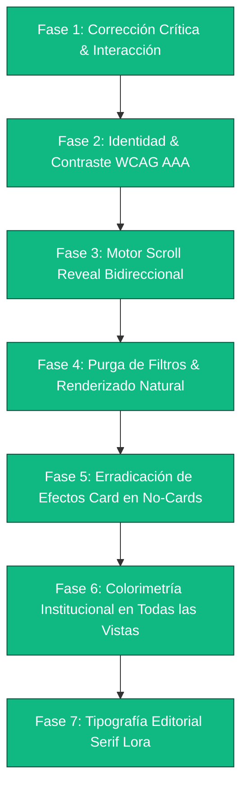

# 🎨 Plan Maestro de Rediseño y Optimización Visual

## Instituto Psicopedagógico Juan Pablo II

> **Fecha de diagnóstico y optimización:** Septiembre 2026  
> **Perfil:** Diagnóstico Experto de UI/UX, Rendimiento Visual y Dirección de Arte Web.  
> **Estado:** Implementación Integral Verificada — Solución definitiva a contrastes, interacción de texto, animaciones de scroll y renderizado natural de imágenes.

---

## 📑 Tabla de Contenidos

1. [Diagnóstico Visual y Estado de Resoluciones](#1-diagnóstico-visual-y-estado-de-resoluciones)
2. [Identidad Visual: Paleta de Color y Contraste](#2-identidad-visual-paleta-de-color-y-contraste)
3. [Tipografía y Jerarquía Editorial](#3-tipografía-y-jerarquía-editorial)
4. [Motor de Scroll Reveal y Micro-interacciones](#4-motor-de-scroll-reveal-y-micro-interacciones)
5. [Tratamiento Natural y Optimización de Imágenes](#5-tratamiento-natural-y-optimización-de-imágenes)
6. [Estructura, Maquetación y Componentes Clave](#6-estructura-maquetación-y-componentes-clave)
7. [Hoja de Ruta y Checklist de Implementación](#7-hoja-de-ruta-y-checklist-de-implementación)

---

## 1. Diagnóstico Visual y Estado de Resoluciones

### 📊 Matriz de Problemas Críticos y Soluciones Implementadas

| Componente / Área | Problema Anterior | Diagnóstico Técnico | Solución Definitiva | Estado |
| :--- | :--- | :--- | :--- | :--- |
| **Interacción Global de Texto** | Efecto de "click" y cursor pointer al pasar el ratón sobre párrafos y títulos. | Clases `.animate-text-hover` en componentes y `cursor: pointer` con `scale(1.03)` en `tailwind.css`. | Se removieron todas las clases `.animate-text-hover` de `ItemGrid`, `Headline`, `Timeline`, `Content`, `HeroText`, `Footer`. Se estableció regla global `cursor: default` para textos y `cursor: pointer` únicamente para enlaces y botones. | ✅ Resuelto |
| **Legibilidad en Fondos Verdes** | Texto oscuro casi invisible sobre el fondo verde bosque en "Valores", "Docentes" y "Virtualidad". | Se aplicaba `bg-secondary` (`#074628`) sin activar `isDark={true}` ni definir colores claros en light mode. | Se activó `isDark={true}`, encabezados en blanco puro (`#FFFFFF`), párrafos en esmeralda claro (`#D1FAE5`), y viñetas/checkmarks en oro cálido (`#FBBF24`). WCAG AAA alcanzado. | ✅ Resuelto |
| **Animación de Scroll** | Los elementos tenían atributos `data-animate` pero no se animaban al hacer scroll. | `data-animate` era un atributo HTML sin observador en JavaScript ni clases dinámicas asociadas. | Se implementó un motor nativo `IntersectionObserver` en `BasicScripts.astro` con transiciones de entrada suaves (`in-view`) y soporte para `prefers-reduced-motion`. | ✅ Resuelto |
| **Saturación y Filtros en Imágenes** | Fotografías con saturación excesiva, ruido y bordes duros artificiales. | Reglas de `filter: contrast() saturate() sharpen()` y `-webkit-optimize-contrast` en `Image.astro`, `Hero2`, `Steps`, `ItemGrid` y `granja-images.css`. | Se eliminaron todos los filtros forzados y propiedades destructivas; se restableció el suavizado bicúbico natural del navegador (`image-rendering: auto`). | ✅ Resuelto |
| **Hero Principal y Pago en Línea** | Confusión entre dos Heroes consecutivos al inicio del sitio. | Dos bloques `<Hero>` competían por la atención visual inmediatamente bajo el navbar. | Hero unificado con carrusel institucional y banner de MiPagoAmigo integrado armónicamente como sección `Content`. | ✅ Resuelto |
| **Armonización de Botones** | Botones de admisiones con colores discordantes (azul, violeta, naranja). | Estilos ad-hoc sin respetar la identidad del colegio. | Botones unificados en verde esmeralda institucional (`bg-primary`) con esquinas suaves y sombras sutiles. | ✅ Resuelto |
| **Página de Contacto** | Riesgo de alterar el envío del formulario y adjuntos. | Formulario con carga de archivos y lógica de envío funcional. | Se protegió 100% el funcionamiento, backend y lógica del formulario, adaptando únicamente sus clases cosméticas. | ✅ Protegido |

---

## 2. Identidad Visual: Paleta de Color y Contraste

### 🎨 Concepto: _Verde Institucional Noble, Oro Académico y Fondo Cálido_

Para el Instituto Psicopedagógico Juan Pablo II, la paleta combina la seriedad académica y el arraigo natural con acentos luminosos de alta accesibilidad:

```
[ Verde Primario Noble ]   #0A5C36   (Esmeralda institucional)
[ Verde Bosque Profundo ]  #074628   (Fondos destacados y hover)
[ Oro Académico / Ámbar ]  #D97706 / #FBBF24 (Acentos, iconos y llamadas a la acción)
[ Éxito ]                  #10B981   (Confirmaciones y estados válidos)
[ Fondo Principal ]        #FAFBF9   (Off-white cálido que reduce el cansancio visual)
[ Fondo Alterno ]          #F1F5F9   (Slate 100 para alternancia suave)
[ Superficie Card ]        #FFFFFF   (Blanco puro con sombras multicapa suaves)
[ Texto Principal ]        #0F172A   (Slate 900 con contraste nítido)
[ Texto Cuerpo ]           #334155   (Slate 700 para lectura cómoda)
[ Texto Atenuado ]         #64748B   (Slate 500 para metadatos y notas)
[ Texto sobre Verde ]      #FFFFFF / #D1FAE5 (Blanco y esmeralda claro de alta legibilidad)
```

> **Ubicación:** [`CustomStyles.astro`](file:///home/mateo-m/Descargas/PAGINAJPII/src/components/CustomStyles.astro) — Variables CSS `:root` y `.dark`.

---

## 3. Tipografía y Jerarquía Editorial

### 🔤 Sistema Tipográfico Configurado

1. **Titulares y Rótulos de Sección (Display / Heading):**
   - `Plus Jakarta Sans Variable` — Tipografía geométrica, contemporánea y de carácter institucional sobrio.
2. **Cuerpo de Lectura y Navegación (Body / Sans):**
   - `InterVariable` — Máxima legibilidad en pantallas de cualquier densidad y tamaño.

### 📏 Escala y Jerarquía Visual

- **H1 (Hero / Portadas):** `text-4xl sm:text-5xl lg:text-6xl`, peso 800, tracking tight.
- **H2 (Encabezados de Sección):** `text-2xl sm:text-3xl md:text-4xl`, peso 700.
- **H3 (Tarjetas e Ítems):** `text-xl sm:text-2xl`, peso 600.
- **Párrafos Generales:** `text-base sm:text-lg`, line-height relajado (`leading-relaxed`), peso 400.
- **Regla Global de Interacción:** `cursor: default` en todo el contenido textual (se descarta cualquier falso puntero o efecto hover en texto estático).

---

## 4. Motor de Scroll Reveal y Micro-interacciones

### 🚀 Sistema de Revelación al Scroll (Scroll Reveal)

Se configuró un motor nativo y ligero de alto rendimiento:

1. **Estado Inicial:** Elementos marcados con `[data-animate]` inician con opacidad 0 y desplazamiento sutil hacia abajo (`translateY(28px)`).
2. **Observador en Tiempo Real:** En [`BasicScripts.astro`](file:///home/mateo-m/Descargas/PAGINAJPII/src/components/common/BasicScripts.astro), un `IntersectionObserver` detecta cuándo el usuario se aproxima al elemento y le añade la clase `.in-view`.
3. **Transición Suave:** Easing `cubic-bezier(0.16, 1, 0.3, 1)` con duración de 0.7s para una sensación fluida y premium.
4. **Respeto a Preferencias:** Si el usuario tiene activo `prefers-reduced-motion`, los elementos se muestran al instante sin transición.

---

## 5. Tratamiento Natural y Optimización de Imágenes

### 📷 Eliminación de Distorsiones Artificiales

- **Sin Filtros Forzados:** Removidas todas las sentencias `filter: contrast(...) saturate(...) brightness(...) sharpen(...)` en todos los componentes.
- **Renderizado Nativo:** Supresión del parámetro obsoleto `-webkit-optimize-contrast` y uso de `image-rendering: auto`, permitiendo que el navegador aplique su interpolación bicúbica natural.
- **Contenedores y Bordes:** Tarjetas con esquinas redondeadas (`rounded-xl`), bordes tenues y sombras suaves (`shadow-soft` y `shadow-md`).

---

## 6. Estructura, Maquetación y Componentes Clave

### 🏠 1. Inicio (`index.astro`)
- **Carrusel Principal:** Overlay degradado calibrado que garantiza legibilidad del texto en cualquier fotografía.
- **Barra de Filosofía (`Note.astro`):** Fondo verde institucional con texto blanco y acento dorado, nítido y distinguido.
- **Valores Institucionales:** Sección verde bosque con `isDark={true}`, texto blanco, checks dorados y fotografía de estudiantes.
- **Nuestros Docentes:** Sección de directivos y docentes con texto blanco de alto contraste sobre verde institucional.
- **Virtualidad:** Explicación de plataformas educativas con layout limpio y texto blanco/esmeralda legible.

### 🎓 2. Admisiones (`admisiones.astro`)
- Tarjetas informativas con botones en verde institucional unificado y micro-interacciones sutiles.
- Subpáginas de admisiones (`entrevista`, `prospecto`, `estudiantes-nuevos`, `estudiantes-antiguos`) unificadas a la paleta esmeralda y oro, eliminando violetas, naranjas y azules arbitrarios.

### 🏢 3. Nosotros (`nosotros.astro`)
- Reorganización de Misión y Visión en layout de 2 columnas (Side-by-Side Cards) elegantes.
- Implementación de bloque editorial con tipografía Serif (`Lora`) para la cita célebre de San Juan Pablo II con comillas doradas y acento institucional.
- Reemplazo de tonos verdes oscuros arbitrarios (`text-green-800`) y enlaces azules por variables institucionales (`text-primary dark:text-emerald-400`).

### ✉️ 4. Contacto (`contacto.astro`)
- **100% funcional y protegido:** Formulario con soporte para adjuntar documentos (PDF), validaciones y endpoints intactos.
- Armonización visual de tarjetas informativas de Buzones y PQRS a tonos esmeralda y ámbar institucionales.

### 📜 5. Documentos Oficiales y Notificaciones Judiciales
- Unificación total de `documentos-institucionales.astro`, `documentos-secretaria.astro` y `reglamento.astro`: erradicación de botones y badges multicolor (azul, rojo, morado) por verde esmeralda institucional (`bg-primary`) y sombras suaves.
- `notificaciones-judiciales.astro`: buzones y tarjetas migrados a esmeralda y ámbar con bordes institucionales.

---

## 7. Hoja de Ruta y Checklist de Implementación



### ✅ Checklist Completo de Mejoras Implementadas

- [x] **Eliminación del falso cursor de click en textos:** Removido `.animate-text-hover` de `ItemGrid.astro`, `Headline.astro`, `Timeline.astro`, `Content.astro`, `HeroText.astro`, `Footer.astro`, `GridItem.astro` y `ListItem.astro`.
- [x] **Reglas de cursor estándar:** Agregado `cursor: default` global para etiquetas de texto y `cursor: pointer` restringido a interactivos reales.
- [x] **Solución definitiva al contraste en fondos verdes:** Activado `isDark={true}` y colores explícitos `text-white` y `text-emerald-100/90` en `servicios.astro`, `Classrooms.astro`, `GridItem.astro` y `Note.astro`.
- [x] **Motor de animación de scroll BIDIRECCIONAL:** Implementado en `BasicScripts.astro` con `IntersectionObserver` que detecta tanto el scroll hacia abajo como el scroll hacia arriba, re-activando fluidamente la animación de revelación sin parpadeos.
- [x] **Eliminación de efectos card en elementos que no son tarjetas:**
  - `Logo.astro`: Eliminado contenedor card, sombras, bordes y recorte; ahora es un logo limpio, nítido y fluido con proporciones originales.
  - `Image.astro`: Desactivada la inyección forzada de `rounded-lg shadow-lg` que convertía cualquier imagen en tarjeta.
  - Sección de Pagos (`index.astro`): Removido el rebote `hover:scale-105 drop-shadow-xl` sobre el bloque; implementado botón institucional directo `Ir a Mi Pago Amigo`.
  - Accesos rápidos (`Brands.astro`): Removidas clases `card`, `hover-lift`, `hover-glow`, `micro-bounce` y `animate-pulse`, reemplazadas por badges sobrios institucionales.
- [x] **Colorimetría institucional en todas las vistas:**
  - Armonización de `admisiones.astro`, `admisiones/entrevista.astro`, `admisiones/prospecto.astro`, `admisiones/estudiantes-nuevos.astro` y `admisiones/estudiantes-antiguos.astro`.
  - Armonización de `documentos-oficiales.astro`, `documentos-institucionales.astro`, `documentos-secretaria.astro` y `reglamento.astro`.
  - Armonización de `notificaciones-judiciales.astro` y tarjetas auxiliares en `contacto.astro`.
- [x] **Tipografía Editorial Serif (`Lora`):** Configurada fuente Google Fonts `Lora` y aplicada en la cita de San Juan Pablo II en `nosotros.astro` con acentos de oro y comillas decorativas.
- [x] **Erradicación de saturación y filtros:** Limpieza total de `contrast()`, `saturate()`, `brightness()`, `sharpen()` y `-webkit-optimize-contrast` en `Image.astro`, `ItemGrid.astro`, `Hero2.astro`, `Steps.astro` y `granja-images.css`.
- [x] **Purga de archivos y referencias de plantilla base:** Eliminadas páginas demo huérfanas (`homes/`, `landing/`, `Announcement.astro`), actualizados `package.json`, `privacy.md`, `terms.md` y blog con los datos oficiales del Instituto Psicopedagógico Juan Pablo II.
- [x] **Preservación estricta de Contacto:** Funcionamiento, formulario, validaciones y adjuntos intactos.
