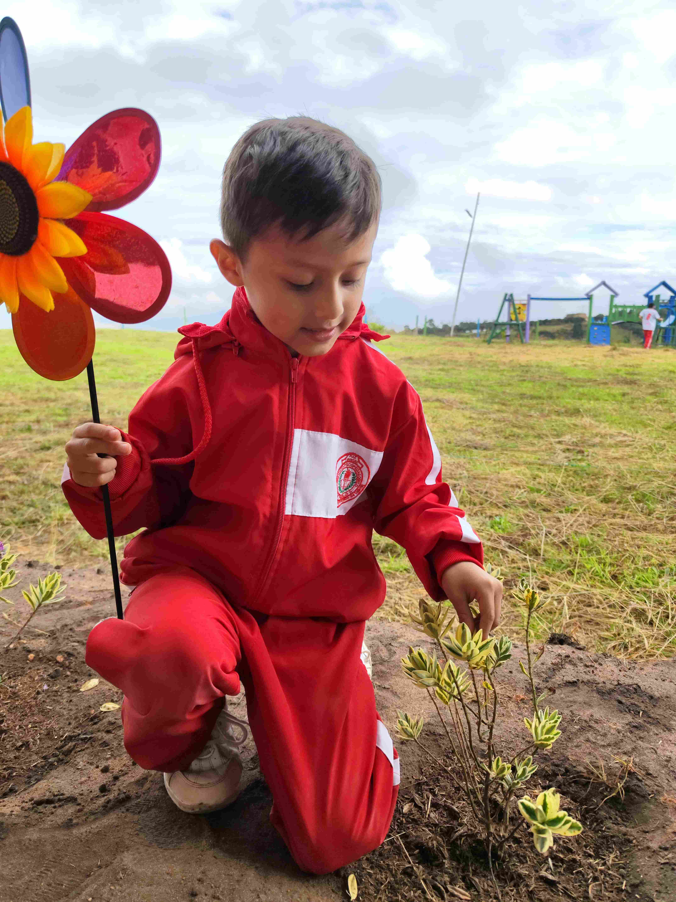
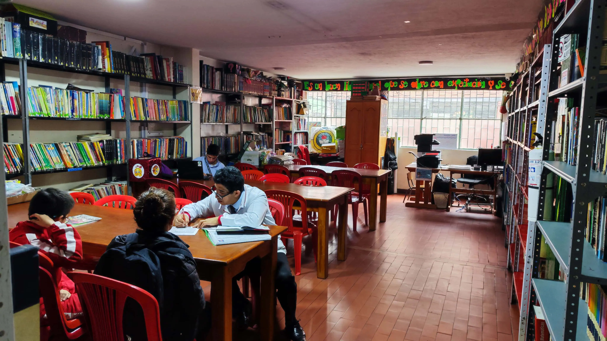
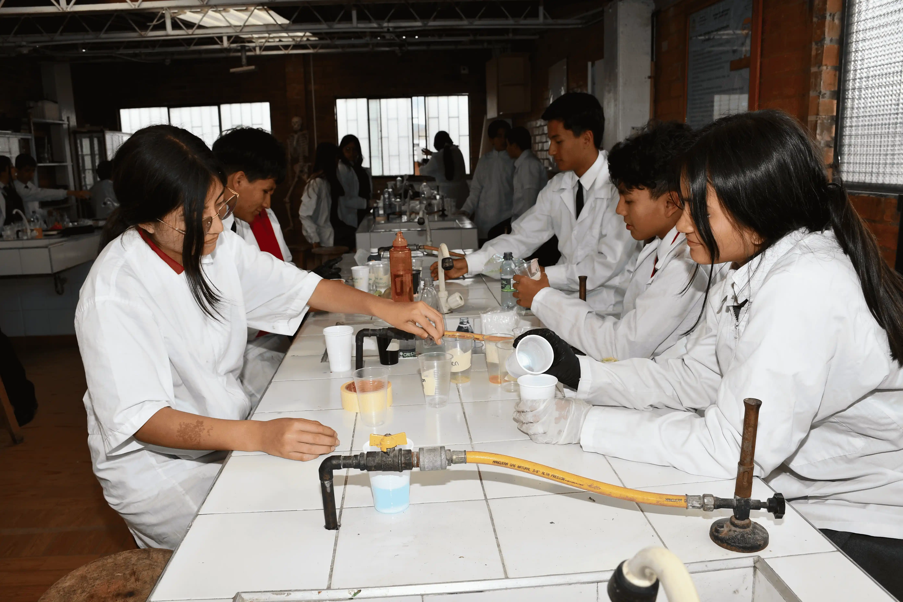
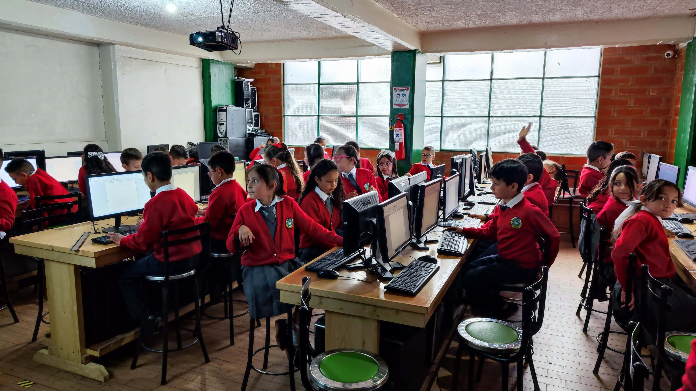
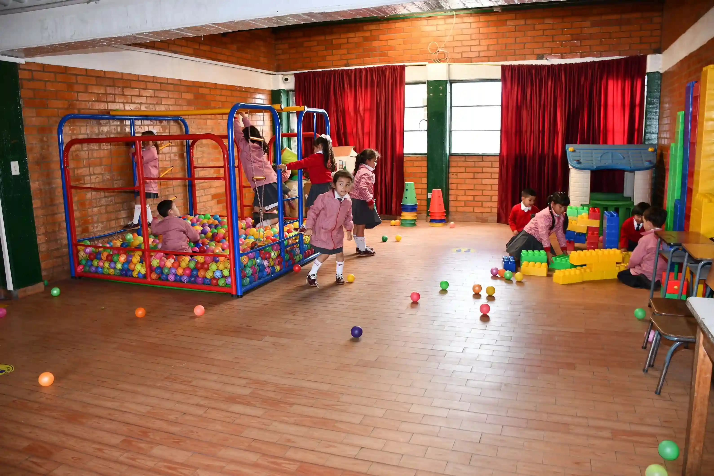

# 🏫 Colegio Juan Pablo II - Sitio Web Oficial

Un sitio web moderno y completo para el Colegio Juan Pablo II, desarrollado con Astro y tecnologías web de vanguardia.

## 📸 Vista Previa

### Página Principal


### Secciones Destacadas

#### 🌱 Granja Escolar

*Actividades de cultivo orgánico y cuidado de animales*

#### 📚 Biblioteca

*Espacios de estudio y recursos educativos*

#### 🔬 Laboratorio

*Instalaciones científicas modernas*

#### 💻 Sistemas

*Aulas de informática y tecnología*

#### 🎮 Ludoteca

*Espacios recreativos y de aprendizaje lúdico*

## 📋 Descripción

Sitio web oficial del **Colegio Juan Pablo II** de Soacha, desarrollado con **[Astro 4.0](https://astro.build/)** y **[Tailwind CSS](https://tailwindcss.com/)**. Una plataforma moderna y responsive que proporciona información institucional, servicios educativos y recursos para la comunidad educativa.

## ✨ Características

- ✅ **Diseño Responsive** - Optimizado para dispositivos móviles y desktop
- ✅ **Navegación Intuitiva** - Menú principal con submenús desplegables
- ✅ **Modo Oscuro** - Soporte completo para tema claro y oscuro
- ✅ **SEO Optimizado** - Meta tags y estructura optimizada para buscadores
- ✅ **Rendimiento Alto** - Puntuaciones excelentes en PageSpeed Insights
- ✅ **Accesibilidad** - Cumple con estándares de accesibilidad web
- ✅ **Blog Integrado** - Sistema de noticias y publicaciones
- ✅ **Formularios de Contacto** - Integración con servicios de email

## 🌐 Estructura del Sitio Web

### 📍 Páginas Principales

#### 🏠 **Inicio** (`/`)
- Página principal con información destacada del colegio
- Carousel de imágenes institucionales
- Accesos rápidos a secciones importantes
- Noticias y eventos recientes

#### 🎓 **Admisiones** (`/admisiones`)
Sección completa de procesos de admisión:
- **Estudiantes Nuevos** (`/admisiones/estudiantes-nuevos`)
  - Requisitos de ingreso
  - Proceso de inscripción
  - Documentación necesaria
- **Estudiantes Antiguos** (`/admisiones/estudiantes-antiguos`)
  - Renovación de matrícula
  - Documentos para antiguos estudiantes
- **Entrevista** (`/admisiones/entrevista`)
  - Información sobre el proceso de entrevista
  - Preparación y requisitos
- **Prospecto Institucional** (`/admisiones/prospecto`)
  - Información detallada de la institución
  - Programas académicos y servicios

#### 📋 **Servicios** (`/servicios`)
- Servicios educativos ofrecidos
- Programas extracurriculares
- Servicios de apoyo estudiantil
- Recursos tecnológicos

#### 🌱 **Granja** (`/Granja`)
- Proyecto educativo de la granja escolar
- Actividades agropecuarias
- Aprendizaje práctico y sostenible

#### 👥 **Nosotros** (`/nosotros`)
- Historia institucional
- Misión, visión y valores
- Equipo directivo y docente
- Infraestructura y instalaciones

#### 📞 **Contacto** (`/contacto`)
- Información de contacto
- Formulario de contacto
- Ubicación y mapa
- Horarios de atención

#### 📄 **Documentos Oficiales**
Sección con documentación institucional importante:
- **Documentos de Secretaría** (`/documentos-oficiales/documentos-secretaria`)
  - Formularios de matrícula
  - Certificados y constancias
  - Documentos administrativos
- **Documentos Institucionales** (`/documentos-oficiales/documentos-institucionales`)
  - Manual de convivencia
  - PEI (Proyecto Educativo Institucional)
  - Resoluciones y normativas

### 📰 **Blog** (`/blog`)
- Noticias institucionales
- Eventos y actividades
- Logros estudiantiles
- Comunicados importantes

## 🗂️ Estructura del Proyecto

```
/
├── public/
│   ├── files/                    # Documentos PDF oficiales
│   │   ├── MANUAL2025.pdf
│   │   ├── CRONOGRAMA2025.pdf
│   │   ├── PROSPECTO_INSTITUCIONAL_2026.pdf
│   │   └── ...
│   ├── Carousel.js              # Script del carousel
│   └── robots.txt
├── src/
│   ├── assets/
│   │   ├── images/              # Imágenes del sitio
│   │   ├── styles/              # Estilos CSS
│   │   └── favicons/            # Iconos del sitio
│   ├── components/
│   │   ├── widgets/
│   │   │   ├── Header.astro     # Navegación principal
│   │   │   └── Footer.astro     # Pie de página
│   │   ├── ui/                  # Componentes de interfaz
│   │   ├── blog/                # Componentes del blog
│   │   ├── Carousel.astro       # Carousel de imágenes
│   │   ├── Chatbot.astro        # Bot de chat
│   │   └── WhatsAppButton.astro # Botón de WhatsApp
│   ├── layouts/
│   │   ├── Layout.astro         # Layout principal
│   │   ├── PageLayout.astro     # Layout de páginas
│   │   └── MarkdownLayout.astro # Layout para markdown
│   ├── pages/
│   │   ├── index.astro          # Página de inicio
│   │   ├── admisiones/          # Sección de admisiones
│   │   ├── documentos-oficiales/ # Documentos institucionales
│   │   ├── [...blog]/           # Sistema de blog
│   │   └── ...
│   ├── utils/                   # Utilidades y helpers
│   ├── config.yaml              # Configuración del sitio
│   └── navigation.js            # Configuración de navegación
├── package.json
├── astro.config.mjs             # Configuración de Astro
└── tailwind.config.cjs          # Configuración de Tailwind
```

## 🚀 Instalación y Desarrollo

### Prerrequisitos
- Node.js 18.17.1 o superior
- npm o yarn

### Comandos

| Comando               | Acción                                             |
| :-------------------- | :------------------------------------------------- |
| `npm install`         | Instala las dependencias                           |
| `npm run dev`         | Inicia servidor de desarrollo en `localhost:3000`  |
| `npm run build`       | Construye el sitio para producción en `./dist/`   |
| `npm run preview`     | Previsualiza la construcción localmente           |
| `npm run format`      | Formatea el código con Prettier                   |
| `npm run lint:eslint` | Ejecuta ESLint                                     |

### Instalación

1. **Clonar el repositorio**
   ```bash
   git clone [URL_DEL_REPOSITORIO]
   cd Colegio_JPII
   ```

2. **Instalar dependencias**
   ```bash
   npm install
   ```

3. **Iniciar servidor de desarrollo**
   ```bash
   npm run dev
   ```

4. **Abrir en el navegador**
   ```
   http://localhost:3000
   ```

## 🛠️ Tecnologías Utilizadas

- **[Astro 4.0](https://astro.build/)** - Framework web moderno
- **[Tailwind CSS](https://tailwindcss.com/)** - Framework de CSS utilitario
- **[React](https://reactjs.org/)** - Componentes interactivos
- **[TypeScript](https://www.typescriptlang.org/)** - Tipado estático
- **[MDX](https://mdxjs.com/)** - Markdown con componentes JSX
- **[Swiper](https://swiperjs.com/)** - Carousel de imágenes
- **[Astro Icon](https://github.com/natemoo-re/astro-icon)** - Sistema de iconos

## 📱 Características Responsive

El sitio está completamente optimizado para dispositivos móviles:

- **Menú hamburguesa** en dispositivos móviles
- **Submenús siempre visibles** en responsive para mejor UX
- **Imágenes optimizadas** para diferentes tamaños de pantalla
- **Tipografía escalable** que se adapta al dispositivo
- **Botones de acción** optimizados para touch

## 🎨 Personalización

### Colores y Tema
Los colores principales se pueden modificar en `tailwind.config.cjs`:
- Verde institucional: `#16a34a`
- Azul secundario: `#2563eb`
- Modo oscuro completamente soportado

### Navegación
La estructura de navegación se configura en `src/navigation.js`:
```javascript
const rootMenu = [
  { text: 'Inicio', href: '/' },
  { text: 'Servicios', href: '/servicios' },
  // ... más elementos
];
```

### Contenido
- **Páginas**: Editar archivos `.astro` en `src/pages/`
- **Componentes**: Modificar en `src/components/`
- **Estilos**: Personalizar en `src/assets/styles/`

## 📧 Contacto y Soporte

- **Sitio Web**: [https://iejuanpabloiisoacha.edu.co](https://iejuanpabloiisoacha.edu.co)
- **Facebook**: [@institutopsicopedagogicojuanpabloii](https://www.facebook.com/institutopsicopedagogicojuanpabloii)
- **Instagram**: [@ipjp2](https://www.instagram.com/ipjp2)
- **TikTok**: [@ipjuanpabloii](https://tiktok.com/@ipjuanpabloii)

## 📄 Licencia

Este proyecto está bajo la licencia MIT. Ver el archivo `LICENSE.md` para más detalles.

---

**Desarrollado con ❤️ para la comunidad educativa del Colegio Juan Pablo II**
